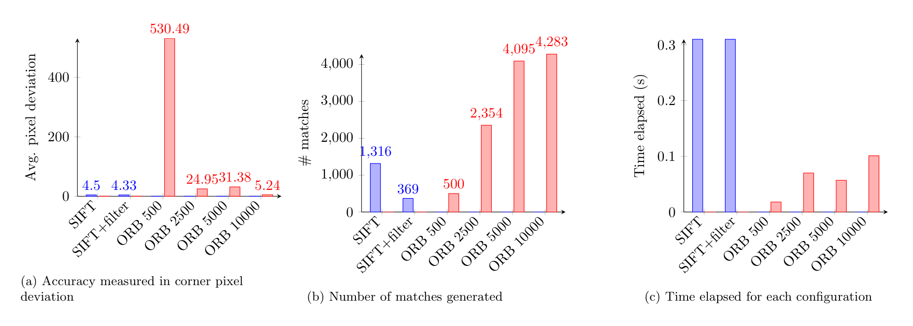
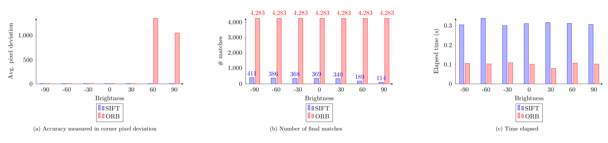
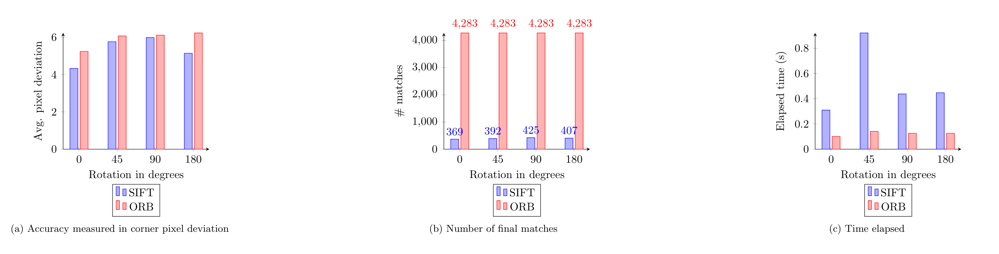
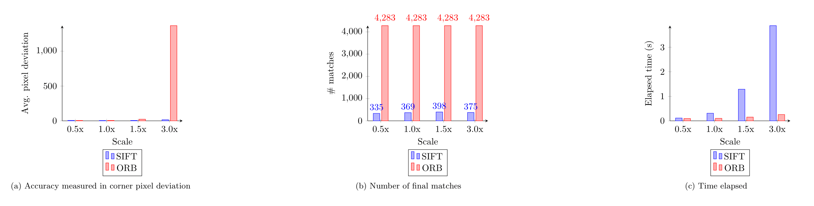

# Object detection using OpenCV
Object detection implementation for finding a specific object in a scene. 

This project facilitates the usage for two object detection algorithms, 
[*SIFT*](https://en.wikipedia.org/wiki/Scale-invariant_feature_transform) and 
[*ORB*](https://en.wikipedia.org/wiki/Oriented_FAST_and_rotated_BRIEF).

## How to run
### How to build targets
```bash
cmake . -B out
```
```bash
cd out && make
```
### Targets
#### Object detection

```./ObjectDetection <object image> <scene image> <output image> <method>```

| Argument     	| Description                                  	|
|--------------	|----------------------------------------------	|
| object image 	| an image of the object to be detected        	|
| scene image  	| an image of a scene to search for the object 	|
| output image 	| path to output resulting image               	|
| method       	| SIFT or ORB detection                        	|

#### Image manipulation
```./ImageManipulation <target image> <output image> <rotate|illuminate|scale> <value>```

| Argument     	| Description                              	|
|--------------	|------------------------------------------	|
| target image 	| input image to transform                 	|
| output image 	| path to resulting output image           	|
| rotate       	| rotate an image  [-360, 360]             	|
| illuminate   	| darken or brighten an image  [-255, 255] 	|
| scale        	| scale up/down an image                   	|
## Homography
The process of object detection gives us a homography that 
can be used to map the corners of the object to scan for, to the scene equivalent corner positions.

The steps for generating the homography are the following:
1. Detect features in both object and scene images
2. Match features between the two images, using OpenCV's brute-force matcher.
3. Filter matches to remove ambiguous cases (SIFT)
4. Compute homography based on the remaining matches. Using RANSAC to exclude inconsistent matches

## SIFT and ORB configurations
### SIFT
SIFT may end up generating several matches for a keypoint, 
that are so close that they are ambiguous. 

To rectify this, we can filter out keypoint matches, 
where the second-best match is beyond a threshold distance from the best match. 

The object detection implementation allows this SIFT match filtering to be turned on and off, 
allowing us to measure how SIFT performs in terms of speed and accuracy, 
with minimal additional processing (as with ORB),
or with additional processing to maximize accuracy.

### ORB
ORB is set to detect a low amount of features by default. This default number might be too low to accurately detect features with, meaning that this number might need to be tweaked with during experimenting.

## Measuring accuracy
The object detection process includes highlighting the object, when found in the scene. 
This makes it possible to measure the accuracy of the detection, 
based on how close the detected boundaries of the scene object are 
to the complete object that we are scanning for. 

Deviation from the actual corner points of the object will be
measured based on the average pixel deviation of all four object corners.

These mapped corner positions allows us to measure the distance between the true corner points, and these homography-based corner points.
The distance is measured using the Euclidean distance formula.

This methodology is however, not scale invariant. Larger image scales will 
have larger distances between two specific scaled points. 
To rectify this, when scaling the scene up by a factor $x$, 
the accuracy calculation can normalize the average distance
according to this scale factor.


### Benchmarks
The respective algorithms each have their strengths. ORB is designed to be fast and efficient, while SIFT is more robust and accurate.

The following graphs will present the accuracy of the algorithms under different scene scenarios, such as changing illumination, rotation and scale.

All experiments following the first, 
will use SIFT with second-best match filtering, and ORB set to detect $10,000$ features, 
which gives both algorithms a chance to perform at their relatively best, 
in the context of this object detection implementation.

#### Experiments
1. Object in scene, some small amount of rotation of object, as well as natural lightning. With and without SIFTs second-best match filtering, as well as with an increasing number of features that ORB is allowed to find.
2. Scene illumination, both darker and brighter for multiple values
3. Scene rotation, using multiple rotation angles
4. Scene scaling, using multiple scaling values

The object in the scene is a book cover, and the scene is an image containing multiple different objects.

The book cover can be found under `assets/bookcover.jpg`, and the scene under `assets/scene.png`.

#### Varying SIFT and ORB configurations
The first experiment aims to establish a baseline, 
and so the scene will contain some small amount of rotation of the object.
The scene will also contain natural lightning, 
which will differ from the object image. 
Apart from this, the scene should be basic, so that both algorithms 
can perform in a scenario with the ideal scene.


SIFT generates fever matches, but these matches are of high quality, 
as they give the lowest possible corner deviation score. 
This is in contrast to ORB, which generates a lot more matches, and so, the corner deviation stays high in comparison to SIFT.

However, when observing time elapsed between the best performing strategies of this experiment, 
which is SIFT with filtering, and ORB set to detect 10,000 features, the SIFT algorithm 
performs comparatively worse.

#### Brightness


In this experiment, SIFT gives favorable results across 
all tested brightness values, whereas ORB fails to detect 
on higher brightness. SIFT manages to successfully detect the object in the scene, 
with a lot less matches than the original experiment had.

The elapsed time for these algorithms in this experiment remain similar to those of the unmodified scene image.

#### Rotation


Both algorithms see an increase in corner deviation.
SIFT ended up with more filtered matches on various rotations, 
but this increased amount of matches could also contribute to a lower corner accuracy.

Both algorithms saw a slight increase in time spent,
compared to that of the original scene image, during various rotations. 
The image that was rotated $45$**°** saw a massive increase in time spent with SIFT, which its counterpart did not experience.

#### Scale


Both algorithms gave a similar low corner deviation score across scales,
except for the largest scale-up. 
SIFT experienced a minor increase of filtered matches on higher scales.

More matches in total means that SIFT found more features for these image scales, 
which corresponds with the elapsed time increase for the larger scales.

## Closing remarks
ORB processed much faster than SIFT across all experiments, 
and performed similarly in terms of accuracy, on *almost* all test values. 
ORB struggled with really brightened and upscaled images, 
meaning that SIFT would be preferable on larger and brighter scenes. 

The much faster processing speed of ORB, 
as well as its comparable accuracy to SIFT on most of the testing values, 
means that it has application merits where an assurance of pixel perfect accuracy is not necessary, 
but where speed is favorable.
